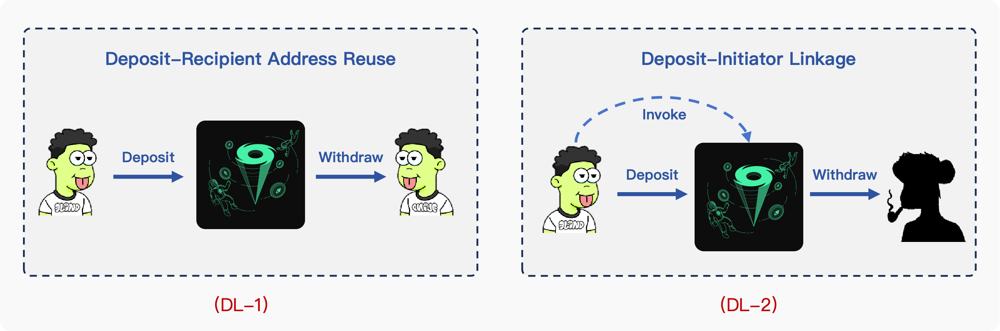
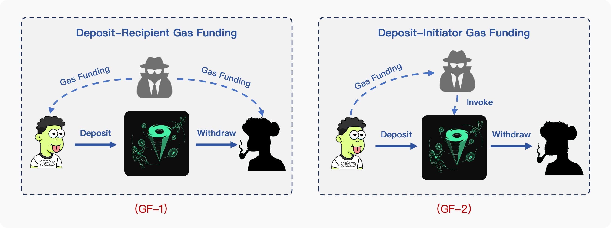
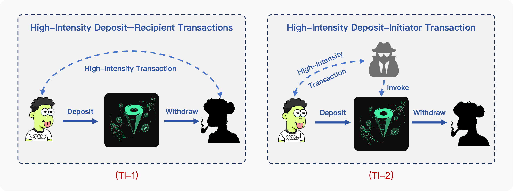

# Tornado Cash Linkage Detection and Empirical Analysis

This repository contains the complete pipeline, dataset, and empirical analysis for detecting Tornado Cash (TC) deposit-withdrawal address linkages and analyzing behavioral patterns around the mixer.

## Table of Contents

- [Project Overview](#project-overview)
- [Dataset](#dataset)
- [Pipeline Overview](#pipeline-overview)
- [Script Reference](#script-reference)
- [Empirical Analysis](#empirical-analysis)
- [Quick Start](#quick-start)

---

## Project Overview

Tornado Cash uses zero-knowledge proofs to break the on-chain linkage between deposit and withdrawal addresses on Ethereum. Existing forensic methods rely on shallow heuristics (gas fees, temporal proximity, amount similarity, ENS ownership) that depend on subjective assumptions. This project provides:

1. **A multidimensional linkage detection method** — leveraging historical transaction patterns of deposit addresses, withdrawal recipients, and withdrawal initiators to identify high-confidence linkage clues.
2. **The Tornado Cash Linkage Dataset** — 10,853 high-confidence deposit-withdrawal address pairs with transaction-level evidence.
3. **Empirical analysis** — structural, temporal, and counterparty behavioral patterns around TC usage.

---

## Dataset

For detailed documentation, see [`dataset/Tornado_Cash_Linkage_Dataset_introduction.md`](dataset/Tornado_Cash_Linkage_Dataset_introduction.md).

### Project Links

| Item | Project-relative path | Description |
|---|---|---|
| Dataset directory | [`dataset/`](dataset/) | Released linkage dataset and documentation |
| Dataset documentation | [`dataset/Tornado_Cash_Linkage_Dataset_introduction.md`](dataset/Tornado_Cash_Linkage_Dataset_introduction.md) | Field definitions, taxonomy, figures, and usage notes |
| Main linkage table | [`dataset/tornadocash_onestep_clues.csv`](dataset/tornadocash_onestep_clues.csv) | Deposit-withdrawal address pairs and linkage metadata |
| Evidence detail table | [`dataset/tornadocash_onestep_clues_details.csv`](dataset/tornadocash_onestep_clues_details.csv) | Transaction-level evidence supporting each linkage record |

### Address Linkage Patterns

The dataset is built from three interpretable address-linkage patterns. Each pattern links Tornado Cash deposit addresses, withdrawal recipients, and non-relayer withdrawal initiators through observable transaction-history evidence. For full field definitions, examples, and usage notes, see the [dataset documentation](dataset/Tornado_Cash_Linkage_Dataset_introduction.md).

#### Direct Linkage

[](dataset/Tornado_Cash_Linkage_Dataset_introduction.md#direct-linkage)

Direct linkage captures the strongest evidence patterns. In `dl_1`, the deposit address is reused as the withdrawal recipient. In `dl_2`, the deposit address appears as a non-relayer withdrawal initiator, linking it to the withdrawal recipient specified in that withdrawal.

Details: [`dl_1` / `dl_2` direct linkage](dataset/Tornado_Cash_Linkage_Dataset_introduction.md#direct-linkage)

#### Gas Funding Linkage

[](dataset/Tornado_Cash_Linkage_Dataset_introduction.md#gas-funding-linkage)

Gas funding linkage captures relationships revealed by ETH funding used to pay transaction fees. In `gf_1`, the deposit address and withdrawal recipient share the same third-party gas funder. In `gf_2`, the deposit address funds the withdrawal initiator that submits the withdrawal transaction.

Details: [`gf_1` / `gf_2` gas funding linkage](dataset/Tornado_Cash_Linkage_Dataset_introduction.md#gas-funding-linkage)

#### Transaction-Intensity Linkage

[](dataset/Tornado_Cash_Linkage_Dataset_introduction.md#transaction-intensity-linkage)

Transaction-intensity linkage captures high-strength interactions in transaction history. In `ti_1`, the deposit address and withdrawal recipient have high-intensity transfers. In `ti_2`, the deposit address and non-relayer withdrawal initiator have high-intensity transfers, and the initiator is linked to the withdrawal recipient specified in the TC withdrawal.

Details: [`ti_1` / `ti_2` transaction-intensity linkage](dataset/Tornado_Cash_Linkage_Dataset_introduction.md#transaction-intensity-linkage)

### Files

| File | Records | Description |
|---|---:|---|
| [`tornadocash_onestep_clues.csv`](dataset/tornadocash_onestep_clues.csv) | 10,853 | Main linkage table with deposit-recipient pairs and metadata |
| [`tornadocash_onestep_clues_details.csv`](dataset/tornadocash_onestep_clues_details.csv) | 25,615 | Transaction-step evidence for each linkage record |

### Dataset Scope

The main linkage table covers four ETH-denominated Tornado Cash pools:

| Pool | Linkage Records |
|---|---:|
| `0_1ETH` | 3,809 |
| `1ETH` | 3,902 |
| `10ETH` | 2,273 |
| `100ETH` | 869 |

### Linkage Categories

| Category | Clue Types | Records |
|---|---|---:|
| Direct linkage | `dl_1`, `dl_2` | 4,729 |
| Gas funding linkage | `gf_1`, `gf_2` | 5,251 |
| Transaction-intensity linkage | `ti_1`, `ti_2` | 873 |

---

## Pipeline Overview

The detection pipeline consists of **10 stages**, from raw blockchain data collection to final clue export.

```
Stage 1-2          Raw transaction data collection (pool + router contracts)
Stage 3            Non-relayer withdrawal initiator extraction
Stage 4            Valid address extraction (deposit / proxy deposit / none-relayer caller)
Stage 5            One-hop transfer trace fetching
Stage 6            Statistical address set computation
Stage 7            Direct linkage clue detection (a1, c1)
Stage 8            Gas funding linkage detection (BTFI algorithm)
Stage 9            Transaction-intensity linkage detection (VATI algorithm)
Stage 10           Clue verification and final export
```

### Data Flow

```
Alchemy API
    ↓
[Stage 1-2] Raw TC deposit/withdraw tables (pool + router contracts)
    ↓
[Stage 3] none_relayer_caller_address via Trace API
    ↓
[Stage 4] Valid addresses extracted → JSON address lists
    ↓
[Stage 5] One-hop trace fetching (ETH + ERC-20) → onestep trace tables
    ↓
[Stage 6] statistical_clues.py → address set statistics JSON
    ↓
[Stage 7] sort_out_clues.py → direct clues (a1, c1)
[Stage 8] BTFI_gas_funding_detection.py → gas funding clues (gf_1, gf_2)
[Stage 9] VATI_detection.py → transaction-intensity clues (ti_1, ti_2)
    ↓
[Stage 10] verify_results.py → DB verification
          get_final_output_onestep_clues.py → final export (CSV + dataset)
```

---

## Script Reference

### Data Collection

**[`code/get_tornadoCash_gas_data_by_Alchemy_multithreading.py`](code/get_tornadoCash_gas_data_by_Alchemy_multithreading.py)**
Fetches all TC-related transactions from Alchemy API for pool contracts (`0xA160...`) and router contracts (`0xd90e...`). Supports multi-threaded API key rotation and constructs transfer tables per pool.

**[`code/get_internal_transfer_caller.py`](code/get_internal_transfer_caller.py)**
Queries the Alchemy Trace API to find the actual transaction initiator (caller) for each TC withdrawal. Distinguishes relayer-initiated transactions from direct user-initiated ones, extracting `none_relayer_caller_address`.

---

### Address Extraction

**[`code/get_tornado_cash_deposit_withdraw_caller_address.py`](code/get_tornado_cash_deposit_withdraw_caller_address.py)**
Consolidates Stages 4.1–4.3 into a single script. Extracts:
- **Deposit addresses** from pool deposit transfer tables (`from_address`)
- **Proxy deposit addresses** from router tables (matched by `tx_hash` to pool deposit tables)
- **Non-relayer withdrawal initiator addresses** from withdraw transfer tables

Outputs JSON files per pool, e.g., `tornadocash_100eth_deposit_withdraw_address.json`.

**[`code/filter_tornado_cash_proxy_address.py`](code/filter_tornado_cash_proxy_address.py)**
Extracts valid proxy deposit addresses by matching router deposit transactions to pool deposit records via `tx_hash`. Distinguishes deposit addresses from withdrawal addresses in the router contract context.

**[`code/build_exclude_address.py`](code/build_exclude_address.py)**
Builds an exclusion address list for downstream analysis. Matches addresses against configurable keyword lists (e.g., exchange names, bridge contracts) to filter out known public infrastructure addresses.

---

### One-Hop Trace Fetching

**[`code/get_deeper_trace_multithreads.py`](code/get_deeper_trace_multithreads.py)**
For each address in the extracted address sets (deposit addresses, withdrawal recipients, non-relayer callers), fetches their one-hop incoming and outgoing transfers from the database. Filters by `category = 'external'` and `asset` in `["ETH", "USDC", "DAI", "WETH", "USDT", "TORN", "WBTC"]`. Results are stored in per-pool one-hop trace tables.

---

### Statistical Address Sets

**[`code/statistical_clues.py`](code/statistical_clues.py)**
Computes deduplicated address sets and transfer target sets for each pool:
- `deposit_address`, `deposit_address_transfer_in/out_address`
- `recipient_address`, `recipient_address_transfer_in/out_address`
- `none_relayer_withdrawer_address`, `none_relayer_withdrawer_address_transfer_in/out_address`

Outputs `*_onestep_transfer_in_out.json` files.

---

### Linkage Clue Detection

**[`code/sort_out_clues.py`](code/sort_out_clues.py)**
Detects **direct linkage clues** by set intersection:
- `a1` (→ `dl_1`): `deposit_address ∩ recipient_address` — same address used for both deposit and withdrawal
- `c1` (→ `dl_2`): `deposit_address ∩ none_relayer_withdrawer_address` — deposit address directly initiates withdrawal

**[`code/BTFI_gas_funding_detection.py`](code/BTFI_gas_funding_detection.py)**
Implements the **BTFI (Balance-Trough First-In) gas funding detection algorithm** to identify shared third-party gas funders:
- `gf_1`: Deposit address and withdrawal recipient share the same gas funder (incoming address)
- `gf_2`: Deposit address funds the withdrawal initiator (outgoing address → initiator)

Outputs verified gas funding clues with confidence scores.

**[`code/VATI_detection.py`](code/VATI_detection.py)**
Implements the **VATI (Volume-And-Time Intensive) detection algorithm** to identify high-intensity transfer relationships:
- `ti_1`: High-intensity transfers between deposit address and withdrawal recipient
- `ti_2`: High-intensity transfers between deposit address and non-relayer withdrawal initiator

Uses score thresholds: `score ≥ 0.9` for 2 transactions, `score ≥ 0.5` for 3–10 transactions, `score ≥ 0.4` for 11+ transactions.

---

### Clue Verification and Export

**[`code/verify_results.py`](code/verify_results.py)**
Verifies each detected clue against the raw database records. For each clue, validates that:
1. Deposit records exist and are temporally valid (`deposit_timestamp < withdraw_timestamp`)
2. Withdraw records exist and are valid
3. Time constraints are satisfied

Stores verified results in `one_step_trace_clues_gasfunding` tables.

**[`code/filter_hgf_hotwallet_gasfunding.py`](code/filter_hgf_hotwallet_gasfunding.py)**
Filters out incorrectly flagged exchange/service addresses from gas funding detection results. Checks `address_labels` table against keyword lists (EXCHANGE, DEX, SERVICES, etc.) and marks false positives with `verify_status = false`.

**[`code/get_final_output_onestep_clues.py`](code/get_final_output_onestep_clues.py)**
Final export script. Integrates clues from three source groups into a unified output schema:
1. `public.one_step_trace_clues_gasfunding` → `direct_linkage` (`dl_1`, `dl_2`)
2. `onestep_clues.one_step_trace_clues_gasfunding` → `gas_funding` (`gf_1`, `gf_2`)
3. `onestep_clues.onestep_trace_clue_frequent_transation` → `transaction_intensity_linkage` (`ti_1`, `ti_2`)

Performs:
- Blacklist filtering (burn addresses)
- Deduplication by `(deposit_address, withdraw_address)` pairs
- Exports main clues CSV and detail traces CSV

---

## Empirical Analysis

For the complete analysis narrative, see [`analysis/Introduction.md`](analysis/Introduction.md).

### Analysis Framework

The empirical analysis operates on a **filtered private ETH interaction subgraph** with three complementary perspectives:

1. **Structural organization** — Pool-level bipartite graph classification (1-to-1, 1-to-many, many-to-1, many-to-many)
2. **Temporal behavior** — Three-stage decomposition: pre-TC funding → in-pool dwell time → post-withdrawal release
3. **Counterparty neighborhood** — One-hop private counterparty breadth and value concentration around withdrawal recipients

### Key Findings

- **Graph structure**: 1-to-1 edges account for 46.6% of all edges; many-to-many edges account for 38.5%. The largest component contains 35 deposit addresses, 59 withdrawal recipients, and 644 linkage edges — a head-simple, tail-complex pattern.
- **Temporal latency**: The median `funding_span_approx` is ~96 days (pre-TC), ~39 days in-pool (temporal matching gap), and ~173 days post-withdrawal (full release gap). TC behaves as a temporal latency stack.
- **Post-TC funnel**: 70% of withdrawal events touch at most 1 downstream counterparty during release scans. The median downstream top-3 value share is 100%. Funds released after TC often route through a narrow funnel, supporting downstream investigation.

### Analysis Artifacts

- [`analysis/02_overview_analysis.ipynb`](analysis/02_overview_analysis.ipynb) — Jupyter notebook for exploratory data analysis and visualization
- [`analysis/docs/`](analysis/docs/) — Framework documentation and section drafts

---

## Quick Start

### Prerequisites

- Python 3.8+
- PostgreSQL database with TC transaction data
- Alchemy API key for blockchain data fetching

### Database Configuration

Set up connection parameters in [`code/config/config.py`](code/config/config.py):

```python
# Database connection settings
DB_HOST = "xxx"
DB_PORT = 5432
DB_NAME = "xxx"
DB_USER = "xxx"
DB_PASSWORD = "xxx"

# Alchemy API configuration
ALCHEMY_API_KEYS = [...]
ALCHEMY_API_KEY_FILE = "xxx"

# Data output directory
tornadocash_data_dir = "xxx"
```

### Running the Pipeline

```bash
# 1. Fetch raw TC transactions (Stages 1-2)
python code/get_tornadoCash_gas_data_by_Alchemy_multithreading.py

# 2. Extract non-relayer caller addresses (Stage 3)
python code/get_internal_transfer_caller.py

# 3. Extract valid addresses (Stage 4)
python code/get_tornado_cash_deposit_withdraw_caller_address.py

# 4. Fetch one-hop traces (Stage 5)
python code/get_deeper_trace_multithreads.py

# 5. Compute statistical address sets (Stage 6)
python code/statistical_clues.py

# 6. Detect direct linkage clues (Stage 7)
python code/sort_out_clues.py

# 7. Detect gas funding linkage clues (Stage 8)
python code/BTFI_gas_funding_detection.py

# 8. Detect transaction-intensity linkage clues (Stage 9)
python code/VATI_detection.py

# 9. Verify clues against database
python code/verify_results.py

# 10. Export final output
python code/get_final_output_onestep_clues.py
```

---

## Project Structure

```
De-anonymizing-Tornado-Cash/
├── README.md                          # This file
├── assets/                            # Linkage pattern figures (DL.png, GF.png, TI.png, n-m.png)
├── code/
│   ├── BTFI_gas_funding_detection.py   # Gas funding linkage detection
│   ├── VATI_detection.py               # Transaction-intensity linkage detection
│   ├── build_exclude_address.py        # Exclusion list builder
│   ├── filter_hgf_hotwallet_gasfunding.py  # Hot wallet false positive filtering
│   ├── filter_tornado_cash_proxy_address.py  # Proxy address extraction
│   ├── filter_tornadocash_address.py   # Legacy TC address extraction
│   ├── get_deeper_trace_multithreads.py  # One-hop trace fetching
│   ├── get_final_output_onestep_clues.py  # Final dataset export
│   ├── get_internal_transfer_caller.py  # Non-relayer caller extraction
│   ├── get_tornadoCash_gas_data_by_Alchemy_multithreading.py  # Raw TC data fetching
│   ├── get_tornado_cash_deposit_withdraw_caller_address.py  # Consolidated address extraction
│   ├── sort_out_clues.py               # Direct linkage clue detection
│   ├── statistical_clues.py            # Statistical address set computation
│   ├── verify_results.py               # Clue verification against DB
│   ├── config/
│   │   └── config.py                   # Configuration and paths
│   └── util/
│       ├── db_tools.py                 # Database connection utilities
│       ├── fio.py                      # File I/O utilities
│       └── log_tools.py                # Logging utilities
├── dataset/
│   ├── Tornado_Cash_Linkage_Dataset_introduction.md  # Dataset documentation
│   ├── tornadocash_onestep_clues.csv   # Main linkage table
│   └── tornadocash_onestep_clues_details.csv  # Evidence detail table
├── analysis/
│   ├── Introduction.md                 # Empirical analysis narrative
│   ├── 02_overview_analysis.ipynb      # Exploratory analysis notebook
│   ├── artifacts/                      # Analysis artifacts and section drafts
│   └── docs/                           # Framework documentation
```

---
