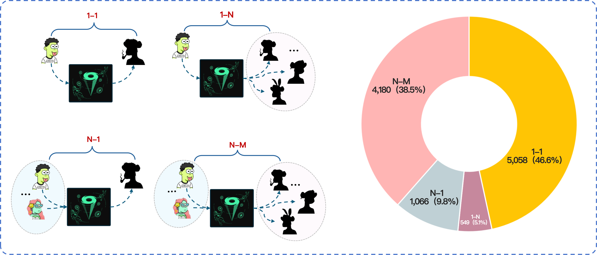

## Overview

The Tornado Cash Linkage Dataset provides high-confidence deposit-withdrawal linkage evidence for Tornado Cash (TC) on Ethereum. The dataset is built from interpretable linkage patterns mined from real transaction histories of three key TC-related address roles: deposit addresses, withdrawal recipients, and withdrawal initiators.

The dataset is designed as a research artifact for mixer forensics, anonymity evaluation, address-linkage benchmarking, and downstream fund-tracing studies. Unlike small manually curated case sets or weak labels derived from a single heuristic, this dataset records explicit deposit-recipient address pairs together with the transaction-level evidence supporting each linkage. It therefore supports both quantitative evaluation and evidence-chain inspection.

## Dataset Files

The release contains seven CSV files:

| File | Rows | Description |
|---|---|---:|
| `tornadocash_onestep_clues.csv` | 10,853 | Main linkage table with deposit-recipient pairs and metadata. |
| `tornadocash_onestep_clues_details.csv` | 25,615 | Transaction-step evidence for each linkage record. |
| `tornadocash_raw_deposit_transactions.csv` | Variable | Raw deposit transactions for addresses in the linkage table. |
| `tornadocash_raw_withdrawal_transactions.csv` | Variable | Raw withdrawal transactions for addresses in the linkage table. |
| `tornadocash_deposit_address_onestep_trace_history.csv` | Variable | One-hop trace history for deposit addresses. |
| `tornadocash_withdrawal_address_onestep_trace_history.csv` | Variable | One-hop trace history for withdrawal addresses. |

## Dataset Scope

The main linkage table covers four ETH-denominated Tornado Cash pools:

| Pool | Linkage Records |
|---|---:|
| `0_1ETH` | 3,809 |
| `1ETH` | 3,902 |
| `10ETH` | 2,273 |
| `100ETH` | 869 |

The dataset integrates three broad linkage categories:

| Linkage Category | `clue` Value | Records |
|---|---|---:|
| Direct linkage | `direct_linkage` | 4,729 |
| Gas funding linkage | `gas_funding` | 5,251 |
| Transaction-intensity linkage | `transaction_intensity_linkage` | 873 |

## `clue_type` Taxonomy

The `clue_type` field specifies the concrete linkage pattern used to generate a record. The taxonomy is intentionally interpretable: each type corresponds to a rule family that can be inspected from transaction history.

| `clue_type` | Category | Count | Meaning |
|---|---|---:|---|
| `dl_1` | Direct linkage | 4,636 | Deposit-recipient address reuse. The deposit address and withdrawal recipient are the same address. |
| `dl_2` | Direct linkage | 93 | Deposit-initiator linkage. The deposit address also appears as a non-relayer withdrawal initiator, linking it to the withdrawal recipient specified in that withdrawal. |
| `gf_1` | Gas funding linkage | 4,910 | Shared third-party gas funding. The deposit address and withdrawal recipient receive gas funding from the same third-party funding address. |
| `gf_2` | Gas funding linkage | 341 | Deposit-to-initiator gas funding. The deposit address funds the withdrawal initiator so that the initiator can submit the withdrawal transaction. |
| `ti_1` | Transaction-intensity linkage | 792 | High-intensity transfers between the deposit address and the withdrawal recipient. |
| `ti_2` | Transaction-intensity linkage | 81 | High-intensity transfers between the deposit address and the non-relayer withdrawal initiator. |

These clue types should be interpreted as high-confidence behavioral linkage evidence, not as cryptographic proof of common ownership. For forensic or compliance use, the records should be combined with independent evidence and explicit assumptions.

## Linkage Pattern Figures

The following figures illustrate the main linkage patterns used to construct the dataset. The image paths are relative to this documentation file.

### Direct Linkage


Direct linkage captures the strongest evidence patterns. In `dl_1`, the deposit address is reused as the withdrawal recipient. In `dl_2`, the deposit address directly appears as a non-relayer withdrawal initiator, which links it to the withdrawal recipient specified in that withdrawal.

### Gas Funding Linkage


Gas funding linkage captures relationships revealed by ETH funding used to pay transaction fees. In `gf_1`, the deposit address and withdrawal recipient share the same third-party gas funder. In `gf_2`, the deposit address funds the withdrawal initiator that submits the withdrawal transaction.

### Transaction-Intensity Linkage


Transaction-intensity linkage captures high-strength interactions in transaction history. In `ti_1`, the deposit address and withdrawal recipient have high-intensity transfers. In `ti_2`, the deposit address and non-relayer withdrawal initiator have high-intensity transfers, and the initiator is linked to the withdrawal recipient specified in the TC withdrawal.

### Pool-Level Linkage Structures



The pool-level linkage graph is built as a bipartite graph between deposit addresses and withdrawal recipients. A `1-1` edge connects one deposit address to one withdrawal recipient. `1-N`, `N-1`, and `N-M` structures capture repeated use, aggregation, dispersion, or coordinated behavior across multiple linked addresses.

## 1. `tornadocash_onestep_clues.csv`

This is the main linkage table. Each row describes one linked address pair in a specific TC pool. The row records the linkage source, linkage subtype, confidence-related statistics, deposit and withdrawal activity summaries, and optional remarks.

| Field | Meaning | Type / Format | Example |
|---|---|---|---|
| `id` | Unique identifier of the linkage record. This field is referenced by `trace_id` in the detail table. | Integer | `2` |
| `pool_name` | Tornado Cash pool associated with the linkage. | String: `100ETH`, `10ETH`, `1ETH`, or `0_1ETH` | `100ETH` |
| `clue` | Broad linkage category. | String: `direct_linkage`, `gas_funding`, or `transaction_intensity_linkage` | `direct_linkage` |
| `clue_type` | Concrete linkage subtype. See the taxonomy above. | String: `dl_1`, `dl_2`, `gf_1`, `gf_2`, `ti_1`, or `ti_2` | `dl_1` |
| `deposit_address` | Address identified on the deposit side of the linkage. | Ethereum address | `0x159b...c2e6` |
| `withdraw_address` | Withdrawal recipient address identified on the withdrawal side of the linkage. This is the recipient of withdrawn funds, not necessarily the transaction sender. | Ethereum address | `0x159b...c2e6` |
| `score` | Confidence score or rule score when available. Some direct-linkage records do not require a score and leave this field empty. | Decimal or empty | `0.5000` |
| `total_tx_count` | Number of transactions used by scoring or intensity statistics when available. | Integer or empty | `22` |
| `total_usd_value` | Total historical USD value associated with the linkage evidence when available. | Decimal or empty | `4343694.66` |
| `deposit_num` | Number of TC deposit transactions associated with the deposit address in this pool-level linkage context. | Integer | `21` |
| `first_deposit_hash` | Hash of the earliest TC deposit transaction associated with this linkage. | Transaction hash | `0x88ff...5964` |
| `first_deposit_timestamp` | Timestamp of the earliest associated TC deposit transaction. | Timestamp | `2021-02-20 01:48:16` |
| `last_deposit_timestamp` | Timestamp of the latest associated TC deposit transaction. | Timestamp | `2021-03-29 05:10:28` |
| `withdraw_num` | Number of TC withdrawal transactions associated with the withdrawal recipient in this pool-level linkage context. | Integer | `20` |
| `first_withdraw_hash` | Hash of the earliest TC withdrawal transaction associated with this linkage. | Transaction hash | `0x3d6f...b2af` |
| `first_withdraw_timestamp` | Timestamp of the earliest associated TC withdrawal transaction. | Timestamp | `2021-03-29 02:52:49` |
| `last_withdraw_timestamp` | Timestamp of the latest associated TC withdrawal transaction. | Timestamp | `2021-05-02 05:48:11` |
| `verify_status` | Whether the linkage passed the dataset-generation validation step. PostgreSQL exports `true` as `t`. | Boolean-like string | `t` |
| `created_at` | Timestamp when the linkage record was written to the final output table. | Timestamp | `2026-02-03 14:52:15.870763` |
| `remark` | Optional auxiliary information, such as detection direction, bidirectionality, transaction count, or USD-value statistics. | Text or empty | `dir: ..., total_tx: 22, total_usd: ...` |

## 2. `tornadocash_onestep_clues_details.csv`

This is the evidence-detail table. It records transaction-level evidence associated with linkage records in the main table. A single linkage record may correspond to multiple detail rows.

The relationship between the two tables is:

```
tornadocash_onestep_clues.id = tornadocash_onestep_clues_details.trace_id
```

| Field | Meaning | Type / Format | Example |
|---|---|---|---|
| `id` | Unique identifier of the detail record. | Integer | `7083` |
| `trace_id` | Linkage record ID in `tornadocash_onestep_clues.csv`. | Integer | `6083` |
| `step_order` | Order of the transaction step within the evidence path. Some records use compound orders such as `1-1` and `2-1` to preserve side-specific or multi-step evidence. | String | `1` |
| `block_num` | Ethereum block number containing the transaction. | Integer | `11399001` |
| `block_timestamp` | Block timestamp. | Timestamp | `2020-12-06 11:52:13` |
| `tx_hash` | Hash of the on-chain transaction used as evidence. | Transaction hash | `0xc883...21a8` |
| `from_address` | Sender, caller, or transfer source address for this transaction step. | Ethereum address | `0xa160...f291` |
| `to_address` | Receiver, callee, or transfer destination address for this transaction step. | Ethereum address | `0x6949...9699` |
| `value` | Transfer value in the unit indicated by `asset`. | Decimal | `100.0` |
| `asset` | Asset transferred in this evidence step. | String | `ETH` |
| `category` | Transaction or evidence category. Values include `external`, `internal`, `erc20`, and `gas_funding`. | String | `internal` |
| `none_relayer_caller_address` | Non-relayer caller address identified for withdrawal-related evidence when available. The field name is kept as exported from the original pipeline. | Ethereum address or empty | `0x63ac...a1c9` |
| `third_party_address` | Third-party address involved in the linkage pattern, such as a shared gas funder. Empty when not applicable. | Ethereum address or empty | `0x025b...5ac3` |

The `category` field in the detail table has the following distribution:

| `category` | Records | Meaning |
|---|---:|---|
| `gas_funding` | 11,410 | Transaction step used as gas-funding evidence. |
| `external` | 11,076 | Externally initiated Ethereum transaction. |
| `erc20` | 2,936 | ERC-20 transfer or token-level evidence step. |
| `internal` | 193 | Internal ETH transfer generated by contract execution. |

The detail table contains multiple assets observed in linkage evidence:

| Asset | Records |
|---|---:|
| `ETH` | 22,679 |
| `USDC` | 1,073 |
| `DAI` | 772 |
| `USDT` | 411 |
| `WETH` | 349 |
| `WBTC` | 220 |
| `TORN` | 111 |

## 3. `tornadocash_raw_deposit_transactions.csv`

Raw deposit transactions associated with deposit addresses in the linkage table. Includes both main pool and proxy deposit records.

| Field | Meaning | Type / Format |
|---|---|---|
| `pool_name` | Pool name (`100ETH`, `10ETH`, `1ETH`, `0_1ETH`). | String |
| `address_type` | Always `deposit_address`. | String |
| `target_address` | The deposit address being described. | Ethereum address |
| `unique_id` | Unique transaction identifier combining tx_hash and category. | String |
| `block_num` | Ethereum block number. | Integer |
| `block_timestamp` | Block timestamp. | Timestamp |
| `tx_hash` | Transaction hash. | Transaction hash |
| `from_address` | Transaction sender. | Ethereum address |
| `to_address` | Transaction receiver (TC contract or proxy). | Ethereum address |
| `value` | Transfer value. | Decimal |
| `asset` | Asset transferred. | String |
| `category` | Transaction category (`external`, `internal`). | String |
| `gas_limit` | Gas limit. | Integer |
| `gas_price` | Gas price in wei. | Integer |
| `max_fee_per_gas` | Max fee per gas (EIP-1559). | Integer |
| `max_priority_fee_per_gas` | Max priority fee per gas (EIP-1559). | Integer |
| `effectivegasprice` | Effective gas price paid. | Integer |
| `gasused` | Gas used by transaction. | Integer |
| `nonce` | Transaction nonce. | Integer |
| `transaction_index` | Transaction index in block. | Integer |
| `input_data` | Transaction input data. | String |
| `tx_type` | Transaction type (EIP-2718 typed transaction). | String |
| `chain_id` | Chain ID. | Integer |
| `none_relayer_caller_address` | Non-relayer caller if applicable. | Ethereum address or empty |
| `gas_cost_ETH` | Total gas cost in ETH. | Decimal |

## 4. `tornadocash_raw_withdrawal_transactions.csv`

Raw withdrawal transactions associated with withdrawal recipient addresses in the linkage table.

| Field | Meaning | Type / Format |
|---|---|---|
| `pool_name` | Pool name (`100ETH`, `10ETH`, `1ETH`, `0_1ETH`). | String |
| `address_type` | Always `withdrawal_address`. | String |
| `target_address` | The withdrawal recipient address being described. | Ethereum address |
| `unique_id` | Unique transaction identifier combining tx_hash and category. | String |
| `block_num` | Ethereum block number. | Integer |
| `block_timestamp` | Block timestamp. | Timestamp |
| `tx_hash` | Transaction hash. | Transaction hash |
| `from_address` | Transaction sender. | Ethereum address |
| `to_address` | Transaction receiver (TC contract or proxy). | Ethereum address |
| `value` | Transfer value. | Decimal |
| `asset` | Asset transferred. | String |
| `category` | Transaction category (`external`, `internal`). | String |
| `gas_limit` | Gas limit. | Integer |
| `gas_price` | Gas price in wei. | Integer |
| `max_fee_per_gas` | Max fee per gas (EIP-1559). | Integer |
| `max_priority_fee_per_gas` | Max priority fee per gas (EIP-1559). | Integer |
| `effectivegasprice` | Effective gas price paid. | Integer |
| `gasused` | Gas used by transaction. | Integer |
| `nonce` | Transaction nonce. | Integer |
| `transaction_index` | Transaction index in block. | Integer |
| `input_data` | Transaction input data. | String |
| `tx_type` | Transaction type (EIP-2718 typed transaction). | String |
| `chain_id` | Chain ID. | Integer |
| `none_relayer_caller_address` | Non-relayer caller if applicable. | Ethereum address or empty |
| `gas_cost_ETH` | Total gas cost in ETH. | Decimal |

## 5. `tornadocash_deposit_address_onestep_trace_history.csv`

One-hop trace history for deposit addresses in the linkage table. Captures transactions where the deposit address appears as sender or receiver, including internal and proxy interactions.

| Field | Meaning | Type / Format |
|---|---|---|
| `address_type` | Always `deposit_address`. | String |
| `target_address` | The deposit address being described. | Ethereum address |
| `unique_id` | Unique transaction identifier combining tx_hash, category, and trace index. | String |
| `transaction_type` | Type: `deposit`, `proxy_deposit`, or `withdraw`. | String |
| `direction` | Transfer direction: `transfer_in` or `transfer_out`. | String |
| `block_num` | Ethereum block number. | Integer |
| `block_timestamp` | Block timestamp. | Timestamp |
| `tx_hash` | Transaction hash. | Transaction hash |
| `from_address` | Transfer source address. | Ethereum address |
| `to_address` | Transfer destination address. | Ethereum address |
| `value` | Transfer value. | Decimal |
| `asset` | Asset transferred. | String |
| `category` | Transaction category (`external`, `internal`). | String |

## 6. `tornadocash_withdrawal_address_onestep_trace_history.csv`

One-hop trace history for withdrawal recipient addresses in the linkage table. Captures transactions where the withdrawal address appears as sender or receiver.

| Field | Meaning | Type / Format |
|---|---|---|
| `address_type` | Always `withdrawal_address`. | String |
| `target_address` | The withdrawal recipient address being described. | Ethereum address |
| `unique_id` | Unique transaction identifier combining tx_hash, category, and trace index. | String |
| `transaction_type` | Type: `deposit`, `proxy_deposit`, or `withdraw`. | String |
| `direction` | Transfer direction: `transfer_in` or `transfer_out`. | String |
| `block_num` | Ethereum block number. | Integer |
| `block_timestamp` | Block timestamp. | Timestamp |
| `tx_hash` | Transaction hash. | Transaction hash |
| `from_address` | Transfer source address. | Ethereum address |
| `to_address` | Transfer destination address. | Ethereum address |
| `value` | Transfer value. | Decimal |
| `asset` | Asset transferred. | String |
| `category` | Transaction category (`external`, `internal`). | String |

## Usage Notes

- `withdraw_address` denotes the withdrawal recipient address, not necessarily the transaction sender of the withdrawal transaction.
- `none_relayer_caller_address` is used to record a non-relayer withdrawal initiator when such an address can be identified.
- Empty cells are exported as empty strings.
- The dataset is organized around address-pair linkage evidence. It should not be interpreted as direct identity attribution.
- For reproducibility, users should preserve the relationship between the main table and the detail table through `id` and `trace_id`.
- For evaluation tasks, we recommend reporting results separately by `clue_type`, because direct linkage, gas funding linkage, and transaction-intensity linkage represent different evidence strengths and coverage profiles.
- Raw transaction files and one-hop trace history files provide supplementary context for addresses appearing in the linkage table. These can be used for deeper forensic analysis or to verify the evidence chain behind specific linkage records.